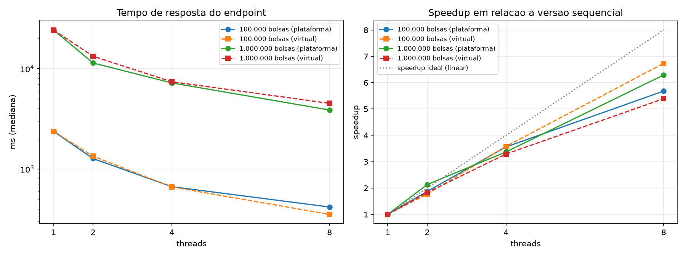

# Atividade — Processamento paralelo no Rota Vital

Operação escolhida: **relatório de cobertura nacional** — cruza cada solicitação de sangue com todo o
estoque de bolsas e conta quantas bolsas disponíveis, dentro da validade, do mesmo componente e
compatíveis (ABO/Rh) poderiam atendê-la. Complexidade sequencial: **O(S × B)**
(S = solicitações, B = bolsas). Com S = 1.000 e B = 1.000.000 são 10⁹ verificações.

## Onde está o código

| Arquivo | Papel |
|---|---|
| `backend/rotavital/.../controller/RelatorioCoberturaController.java` | Endpoint `GET /api/relatorios/cobertura` |
| `backend/rotavital/.../service/CoberturaEstoqueService.java` | Versões sequencial, `ExecutorService` (plataforma) e virtual threads |
| `backend/rotavital/.../service/GeradorDadosService.java` | Gera a massa de dados em memória (semente fixa, cacheada) |
| `backend/rotavital/.../service/CoberturaEstoqueServiceTest.java` | Garante que todas as versões devolvem exatamente o mesmo resultado |
| `docs/atividade-threads/medir.py` | Mede o endpoint, gera `resultados.csv`, `resumo.csv` e `grafico.png` |

Cada thread recebe uma fatia contígua das solicitações, lê o estoque (somente leitura) e acumula em
uma parcial própria; no final as parciais são somadas. Não há estado compartilhado mutável.

## Como executar

```bash
cd backend/rotavital
./mvnw test                          # inclui o teste de igualdade sequencial x paralelo
./mvnw spring-boot:run               # sobe a API em http://localhost:8080

# exemplo de chamada
curl "http://localhost:8080/api/relatorios/cobertura?bolsas=1000000&solicitacoes=1000&threads=8"
curl "http://localhost:8080/api/relatorios/cobertura?bolsas=1000000&threads=8&virtual=true"

# medição completa (outro terminal; requer: pip install matplotlib)
python docs/atividade-threads/medir.py
```

Parâmetros: `bolsas` (1–2.000.000), `solicitacoes` (1–100.000), `threads` (1–64; `1` = sequencial),
`virtual` (`true` usa virtual threads do Java 21).

## Resultados

Máquina: Intel Core i5-12450HX (8 núcleos físicos — 4 de desempenho com HT + 4 de eficiência —,
12 threads lógicas), 16 GB RAM, Windows 11, JDK 21. Mediana de 5 execuções intercaladas por
configuração, 1.000 solicitações, tempo de resposta HTTP medido pelo cliente.

| Bolsas | Versão | Threads | Tempo (ms) | Speedup |
|---:|---|---:|---:|---:|
| 100.000 | Sequencial | 1 | 2.372 | 1,00 |
| 100.000 | Plataforma | 2 | 1.270 | 1,87 |
| 100.000 | Plataforma | 4 | 666 | 3,56 |
| 100.000 | Plataforma | 8 | 418 | 5,68 |
| 100.000 | Virtual | 2 | 1.342 | 1,77 |
| 100.000 | Virtual | 4 | 662 | 3,58 |
| 100.000 | Virtual | 8 | 353 | 6,73 |
| 1.000.000 | Sequencial | 1 | 24.350 | 1,00 |
| 1.000.000 | Plataforma | 2 | 11.410 | 2,13 |
| 1.000.000 | Plataforma | 4 | 7.215 | 3,37 |
| 1.000.000 | Plataforma | 8 | 3.874 | 6,29 |
| 1.000.000 | Virtual | 2 | 13.324 | 1,83 |
| 1.000.000 | Virtual | 4 | 7.409 | 3,29 |
| 1.000.000 | Virtual | 8 | 4.517 | 5,39 |



Observação: a variação entre execuções foi de ~10–30% (turbo e frequência do processador em
notebook), por isso o script intercala as configurações e usa a mediana. Diferenças pequenas —
como virtual × plataforma, ou o 2,13x com 2 threads — estão dentro desse ruído.
