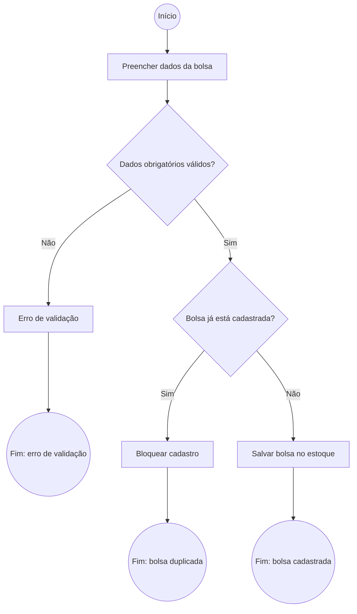
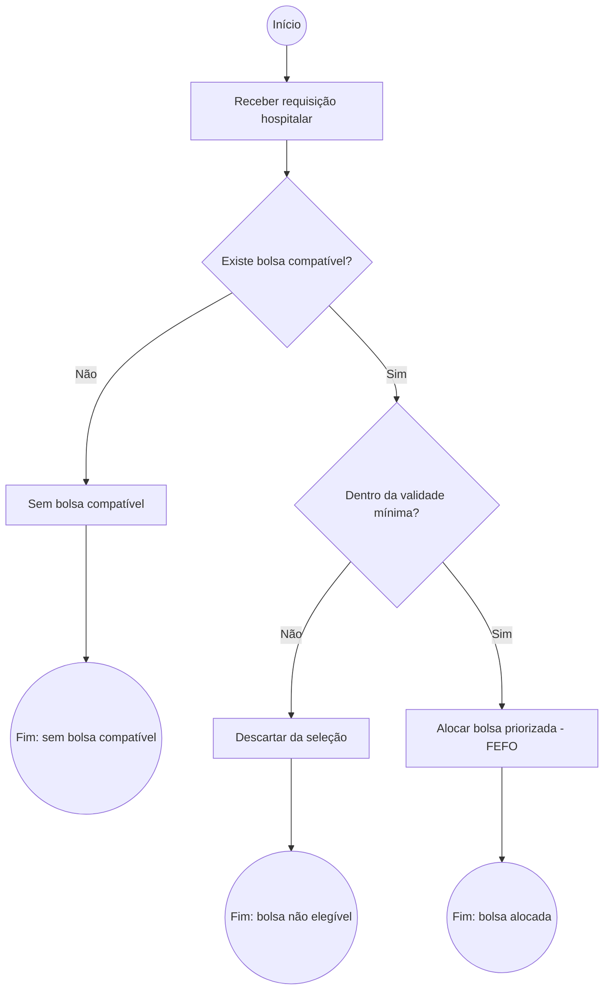
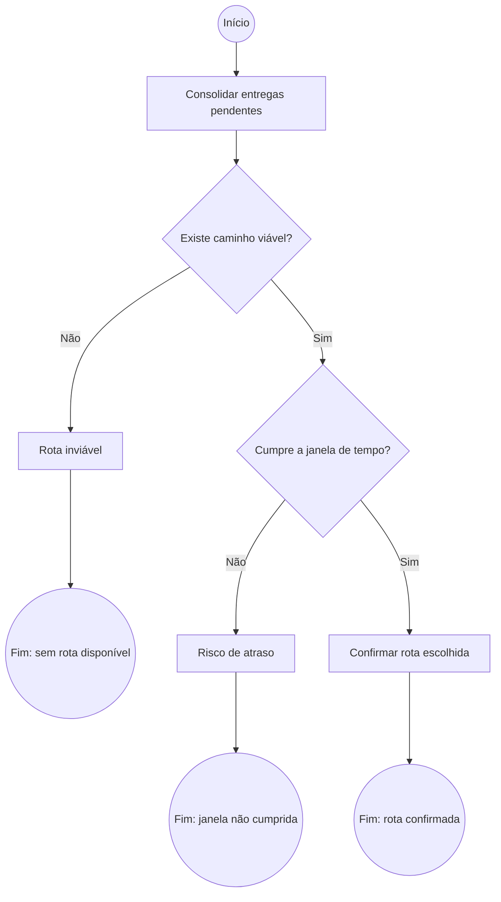
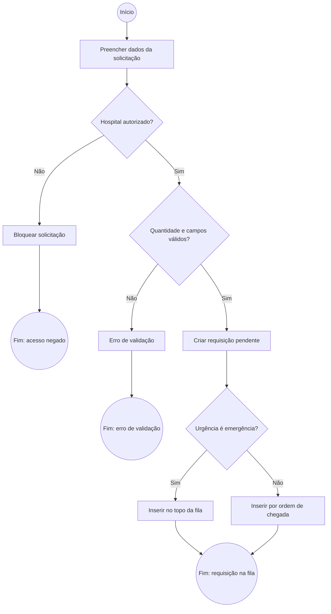
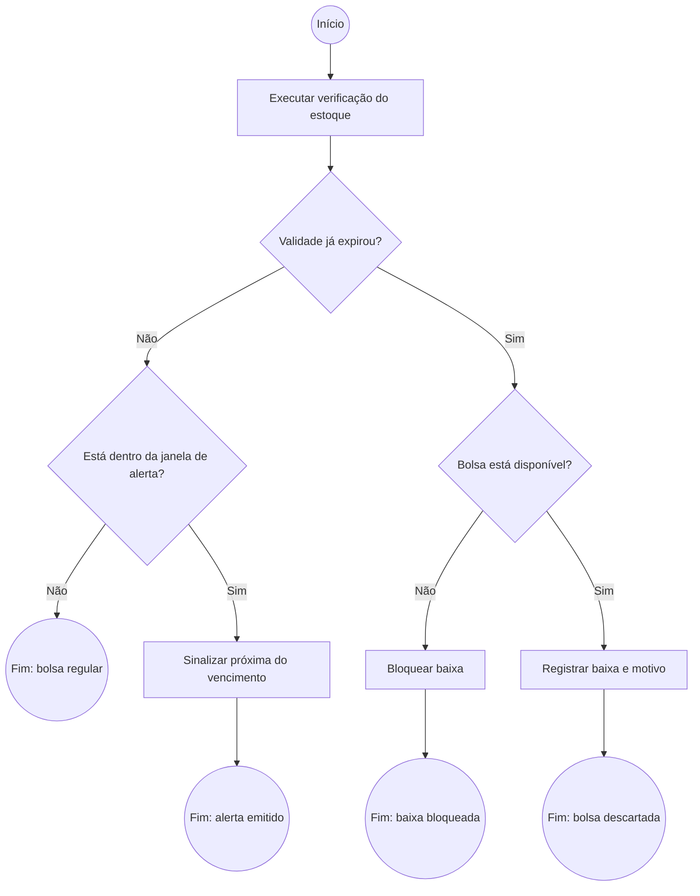
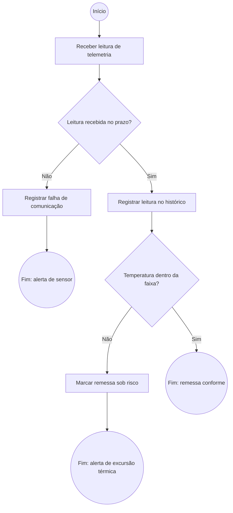
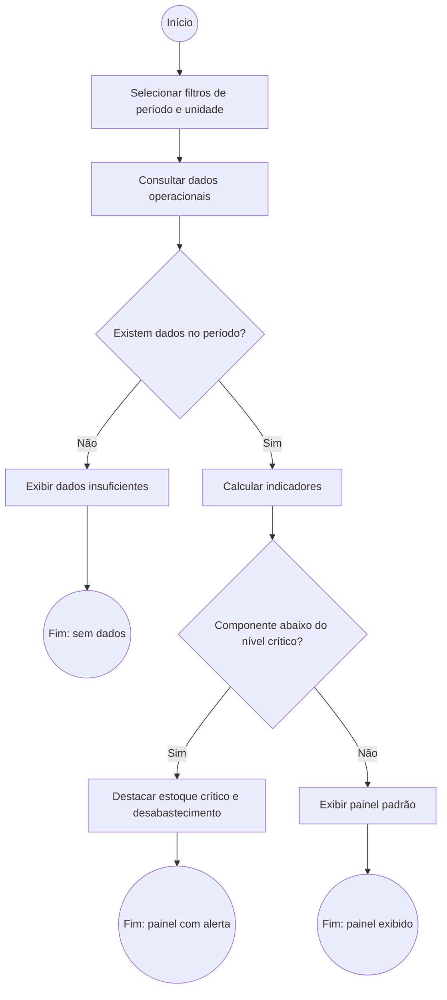

## 1. Cadastro de bolsa de hemocomponente

### Card
Como operador do banco de sangue, quero registrar uma nova bolsa de hemocomponente no estoque, para que ela fique disponível para alocação e rastreamento.

### Conversation
- Campos obrigatórios: tipo sanguíneo (ABO/Rh), tipo de componente, data de coleta, validade, volume
- Geração do identificador único da bolsa
- Validação de duplicidade (mesma bolsa cadastrada duas vezes)
- Regra de negócio: validade não pode ser anterior à data de coleta

### Confirmation (BDD)
```gherkin
Funcionalidade: Cadastro de bolsa de hemocomponente

  Cenário: Cadastro bem-sucedido
    Dado que estou logado como operador do banco de sangue
    E preencho tipo sanguíneo, componente, data de coleta e validade corretamente
    Quando confirmo o cadastro
    Então a bolsa é salva com status "disponível"
    E a bolsa passa a aparecer no estoque

  Cenário: Campo obrigatório ausente
    Dado que estou cadastrando uma nova bolsa
    Quando deixo um campo obrigatório em branco
    E tento salvar
    Então o sistema exibe o erro "Campo obrigatório vazio"
    E a bolsa não é salva

  Cenário: Bolsa duplicada
    Dado que já existe uma bolsa cadastrada com o mesmo identificador
    Quando tento cadastrar essa bolsa novamente
    Então o sistema bloqueia o cadastro
    E exibe a mensagem "Bolsa já existe"
```

### INVEST
| Critério | Avaliação |
|---|---|
| Independente | Não depende de alocação ou rota — é a base do estoque |
| Negociável | Os campos exatos podem ser ajustados com a equipe |
| Valiosa | Sem estoque cadastrado, nenhuma outra funcionalidade opera |
| Estimável | Escopo claro o suficiente para estimar em horas/pontos |
| Pequena | Cabe em uma tarefa/sprint isolada |
| Testável | Critérios de aceite verificáveis via os cenários BDD acima |

### Diagrama de atividades


---

## 2. Alocação de bolsa compatível priorizando validade (FEFO)

### Card
Como operador do banco de sangue, quero que o sistema sugira automaticamente as bolsas compatíveis mais próximas do vencimento, para reduzir o descarte por validade.

### Conversation
- Regra de compatibilidade ABO/Rh (doador/receptor universal)
- Critério FEFO: bolsa com validade mais próxima sai primeiro
- Validade mínima aceitável para uma bolsa entrar na seleção
- Alocação automática ou confirmada manualmente pelo operador

### Confirmation (BDD)
```gherkin
Funcionalidade: Alocação de bolsa compatível priorizando validade (FEFO)

  Cenário: Alocação bem-sucedida
    Dado que existe uma requisição pendente para um tipo sanguíneo específico
    E há bolsas compatíveis em estoque com validades diferentes
    Quando o sistema aloca a bolsa
    Então a bolsa com validade mais próxima é selecionada
    E seu status muda para "alocada"

  Cenário: Nenhuma bolsa compatível
    Dado que não há bolsas compatíveis com o tipo solicitado
    Quando o sistema tenta alocar
    Então o hospital é notificado da indisponibilidade
    E a requisição permanece pendente

  Cenário: Bolsa fora do prazo de segurança
    Dado que uma bolsa compatível está fora da validade mínima aceitável
    Quando o sistema avalia as opções
    Então essa bolsa é descartada da seleção
    E não é oferecida para alocação
```

### INVEST
| Critério | Avaliação |
|---|---|
| Independente | Depende do cadastro de bolsas já existir, mas é isolável como funcionalidade própria |
| Negociável | Critério de desempate e regra de validade mínima podem ser refinados |
| Valiosa | Reduz descarte por vencimento e agiliza o atendimento hospitalar |
| Estimável | Regras de compatibilidade e ordenação são bem definidas |
| Pequena | Foco único: selecionar e alocar uma bolsa por requisição |
| Testável | Cenários BDD cobrem sucesso e as duas falhas principais |

### Diagrama de atividades


---

## 3. Cálculo de rota de distribuição

### Card
Como operador de logística, quero visualizar a rota mais eficiente para entregar hemocomponentes a um ou mais hospitais, para garantir entrega dentro da janela de tempo permitida.

### Conversation
- Algoritmo de caminho mínimo (Dijkstra vs A*)
- Modelagem do grafo (nós = hospitais/depósitos, arestas = distância/tempo/temperatura)
- Comportamento quando nenhuma rota cumpre a janela de tempo
- Respeito à cadeia fria durante o transporte

### Confirmation (BDD)
```gherkin
Funcionalidade: Cálculo de rota de distribuição

  Cenário: Rota calculada com sucesso
    Dado que existem entregas pendentes com hospitais de destino definidos
    Quando o sistema calcula a rota
    Então o caminho de menor custo é retornado
    E a rota cumpre a janela de tempo exigida

  Cenário: Nenhum caminho viável
    Dado que não existe conexão no grafo entre o depósito e o hospital
    Quando o sistema tenta calcular a rota
    Então o sistema alerta que não há rota disponível

  Cenário: Janela de tempo não cumprida
    Dado que a rota calculada excede o tempo permitido pela cadeia fria
    Quando o sistema avalia o resultado
    Então o operador é alertado sobre o risco de atraso
    E a rota não é confirmada automaticamente
```

### INVEST
| Critério | Avaliação |
|---|---|
| Independente | Depende de haver bolsas alocadas, mas o cálculo de rota é um módulo isolável |
| Negociável | Escolha do algoritmo (Dijkstra/A*) pode ser decidida em equipe |
| Valiosa | Garante entrega dentro do prazo e da cadeia fria |
| Estimável | Problema de grafos bem conhecido, com escopo controlado |
| Pequena | Cobre apenas o cálculo e a confirmação de uma rota por vez |
| Testável | Cenários BDD cobrem sucesso, ausência de rota e violação de prazo |

### Diagrama de atividades


---

## 4. Solicitação hospitalar de hemocomponentes

### Card
Como responsável pelo estoque de um hospital, quero registrar uma solicitação de hemocomponentes informando tipo, quantidade e urgência, para que o hemocentro receba e priorize meu pedido.

### Conversation
- Campos obrigatórios: hospital solicitante, tipo de componente, tipo sanguíneo, quantidade e nível de urgência (eletiva/urgente/emergência)
- Fila de prioridade: emergências entram à frente das eletivas, independentemente da ordem de chegada
- Quantidade solicitada deve ser maior que zero e respeitar o limite máximo por requisição
- Estados da requisição: pendente → em atendimento → atendida / cancelada
- O hospital acompanha o status da própria solicitação

### Confirmation (BDD)
```gherkin
Funcionalidade: Solicitação hospitalar de hemocomponentes

  Cenário: Solicitação registrada com sucesso
    Dado que estou logado como responsável de um hospital cadastrado
    E informo componente, tipo sanguíneo, quantidade e urgência válidos
    Quando confirmo a solicitação
    Então a requisição é criada com status "pendente"
    E ela entra na fila de atendimento do hemocentro

  Cenário: Quantidade inválida
    Dado que estou registrando uma solicitação
    Quando informo quantidade igual a zero ou negativa
    E tento salvar
    Então o sistema exibe o erro "Quantidade inválida"
    E a requisição não é criada

  Cenário: Priorização por urgência
    Dado que existem requisições eletivas pendentes na fila
    Quando registro uma requisição com urgência "emergência"
    Então essa requisição é posicionada à frente das eletivas
    E aparece no topo da fila de atendimento
```

### INVEST
| Critério | Avaliação |
|---|---|
| Independente | Pode ser construída antes da alocação — a requisição existe mesmo sem bolsa disponível |
| Negociável | Níveis de urgência e limite por requisição podem ser ajustados com a equipe |
| Valiosa | É a porta de entrada da demanda hospitalar no sistema |
| Estimável | CRUD com validações e fila de prioridade, escopo bem delimitado |
| Pequena | Cobre apenas o registro e a entrada na fila, não o atendimento |
| Testável | Cenários BDD cobrem sucesso, validação e regra de priorização |

### Diagrama de atividades


---

## 5. Alerta e baixa de bolsas próximas do vencimento

### Card
Como gestor do hemocentro, quero ser alertado sobre bolsas próximas do vencimento e dar baixa nas vencidas, para reduzir o descarte e impedir que uma bolsa inválida seja distribuída.

### Conversation
- Janela de alerta configurável por tipo de componente (plaquetas alertam antes de hemácias)
- Verificação periódica automática do estoque
- Bolsa vencida muda para status "descartada" e sai da base de alocação
- Bolsa alocada ou em transporte não pode receber baixa sem cancelamento prévio da alocação
- Registro do motivo da baixa para compor a taxa de descarte

### Confirmation (BDD)
```gherkin
Funcionalidade: Alerta e baixa de bolsas próximas do vencimento

  Cenário: Alerta de bolsa próxima do vencimento
    Dado que existe uma bolsa disponível dentro da janela de alerta do seu componente
    Quando o sistema executa a verificação de validade
    Então a bolsa é sinalizada como "próxima do vencimento"
    E o gestor visualiza o alerta no painel de estoque

  Cenário: Baixa automática de bolsa vencida
    Dado que existe uma bolsa disponível com validade anterior à data atual
    Quando o sistema executa a verificação de validade
    Então o status da bolsa muda para "descartada"
    E ela deixa de ser considerada nas alocações

  Cenário: Tentativa de baixa em bolsa alocada
    Dado que uma bolsa está com status "alocada"
    Quando tento registrar a baixa por vencimento
    Então o sistema bloqueia a operação
    E exibe a mensagem "Cancele a alocação antes de dar baixa"
```

### INVEST
| Critério | Avaliação |
|---|---|
| Independente | Opera sobre o estoque existente, sem depender de rota ou telemetria |
| Negociável | Janelas de alerta e grau de automação da baixa podem ser refinados |
| Valiosa | Ataca diretamente o descarte por vencimento citado no problema do projeto |
| Estimável | Regra temporal simples sobre entidades já modeladas |
| Pequena | Restrita a alertar e dar baixa, sem reposição de estoque |
| Testável | Cenários BDD cobrem alerta, baixa automática e bloqueio |

### Diagrama de atividades


---

## Implementação de Entrega 02 - Álocação compatível com FEFO

### Regra aplicada
- Compatibilidade ABO/Rh: o receptor recebe apenas bolsas compatíveis com seu tipo sanguíneo e fator Rh.
- O sistema ignora bolsas fora do estoque disponível, expiradas, alocadas ou incompatíveis.
- Para as bolsas elegíveis, aplica-se FEFO: a bolsa cuja validade está mais próxima da data atual é priorizada.
- A bolsa selecionada recebe status "ALOCADA".

### Endpoint implementado
- Método: POST
- URL: /api/allocations/requests/{requestId}/allocate
- Resposta de sucesso: retorna o id da bolsa, flag allocated=true e mensagem de confirmação.
- Resposta sem estoque compatível: retorna allocated=false e mensagem indicando ausência de bolsa disponível.

### Exemplo de uso
```http
POST /api/allocations/requests/1/allocate
```

Exemplo de resposta:
```json
{
  "bagId": 7,
  "allocated": true,
  "message": "Bolsa alocada com sucesso conforme compatibilidade ABO/Rh e regra FEFO."
}
```

### Observações
- A implementação foi mantida no padrão Spring MVC do projeto: controller → service → repository.
- Como o projeto ainda não possuía a modelagem completa de estoque e solicitações no início da entrega, foi criada a camada mínima compatível com a arquitetura já proposta em Spring Boot.

---

## 6. Monitoramento da cadeia fria durante o transporte

### Card
Como operador de logística, quero acompanhar a temperatura das remessas em trânsito, para identificar rapidamente quando uma carga sai da faixa segura e agir antes da perda das bolsas.

### Conversation
- Faixa de temperatura aceitável por tipo de componente (hemácias, plasma, plaquetas)
- Leituras de telemetria simuladas, recebidas em intervalos regulares durante o trajeto
- Excursão térmica: leitura fora da faixa gera alerta e marca a remessa como "sob risco"
- Perda de comunicação com o sensor acima do intervalo máximo também gera alerta
- Histórico de leituras registrado para auditoria da remessa

### Confirmation (BDD)
```gherkin
Funcionalidade: Monitoramento da cadeia fria durante o transporte

  Cenário: Transporte dentro da faixa segura
    Dado que existe uma remessa em trânsito com sensor ativo
    Quando o sistema recebe uma leitura dentro da faixa do componente
    Então a leitura é registrada no histórico da remessa
    E a remessa permanece com status "conforme"

  Cenário: Excursão térmica detectada
    Dado que existe uma remessa em trânsito
    Quando o sistema recebe uma leitura fora da faixa aceitável
    Então a remessa é marcada como "sob risco"
    E o operador de logística recebe um alerta de excursão térmica

  Cenário: Perda de comunicação com o sensor
    Dado que uma remessa está em trânsito
    Quando nenhuma leitura é recebida além do intervalo máximo permitido
    Então o sistema registra falha de comunicação
    E emite alerta de sensor indisponível
```

### INVEST
| Critério | Avaliação |
|---|---|
| Independente | Consome remessas existentes, mas o monitoramento é um módulo isolável |
| Negociável | Faixas, intervalo de leitura e limite de silêncio são parametrizáveis |
| Valiosa | Garante o requisito de "temperatura certa" e evita a perda da carga |
| Estimável | Ingestão de leituras simuladas com regras de faixa bem definidas |
| Pequena | Cobre recepção, avaliação e alerta, sem decidir o destino da carga |
| Testável | Cenários BDD cobrem leitura conforme, excursão e ausência de sinal |

### Diagrama de atividades


---

## 7. Painel de indicadores da rede de sangue

### Card
Como gestor do hemocentro, quero visualizar um painel com indicadores de estoque, demanda e descarte, para apoiar decisões de reposição e distribuição.

### Conversation
- Indicadores: estoque por componente e tipo sanguíneo, demanda por hospital, tempo médio de atendimento, taxa de descarte por vencimento e probabilidade de desabastecimento
- Filtros por período, hospital e tipo de componente
- Comportamento do painel quando não há dados suficientes no período filtrado
- Números recalculados a cada consulta, a partir dos dados operacionais do sistema
- Destaque para componentes com estoque abaixo do nível crítico

### Confirmation (BDD)
```gherkin
Funcionalidade: Painel de indicadores da rede de sangue

  Cenário: Visualização dos indicadores
    Dado que existem bolsas, requisições e entregas registradas no período
    Quando acesso o painel de indicadores
    Então vejo estoque por componente, demanda por hospital e taxa de descarte
    E os valores refletem os dados operacionais do período selecionado

  Cenário: Período sem dados suficientes
    Dado que seleciono um período sem movimentações registradas
    Quando o painel é carregado
    Então o sistema exibe a mensagem "Dados insuficientes para o período"
    E nenhum indicador é calculado sobre base incompleta

  Cenário: Alerta de estoque crítico
    Dado que um componente está com estoque abaixo do nível crítico definido
    Quando acesso o painel de indicadores
    Então esse componente é destacado como "estoque crítico"
    E a probabilidade de desabastecimento é apresentada ao gestor
```

### INVEST
| Critério | Avaliação |
|---|---|
| Independente | Apenas lê dados já produzidos pelos demais módulos, sem alterá-los |
| Negociável | O conjunto de indicadores e os níveis críticos podem ser priorizados aos poucos |
| Valiosa | Transforma a operação em informação para decisão de reposição |
| Estimável | Agregações e estatística descritiva sobre entidades já existentes |
| Pequena | Restrita à consulta e exibição, sem ações corretivas automáticas |
| Testável | Cenários BDD cobrem exibição, ausência de dados e estoque crítico |

### Diagrama de atividades

