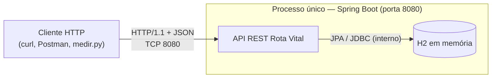
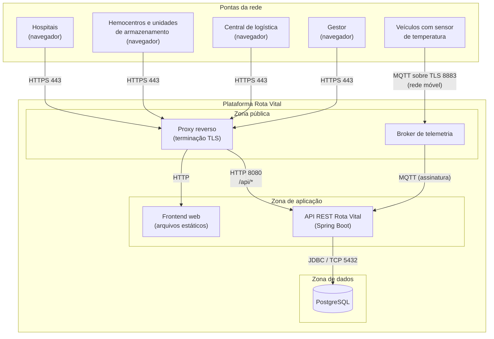
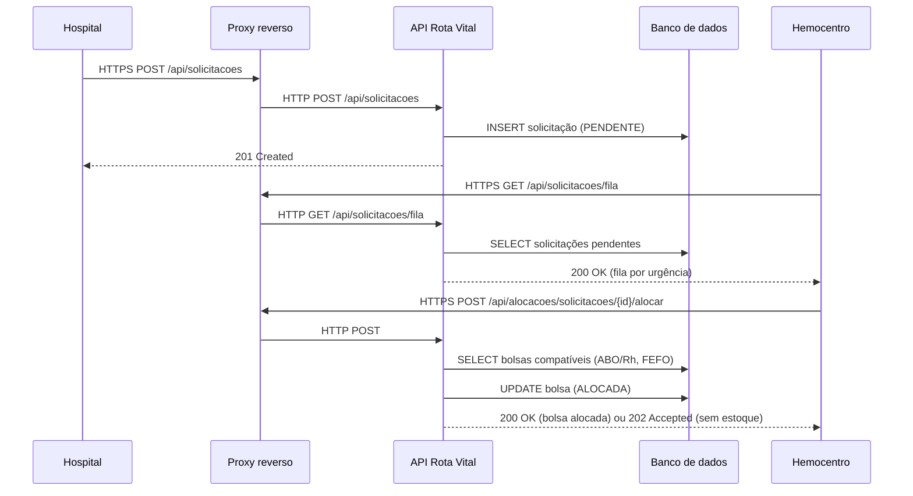
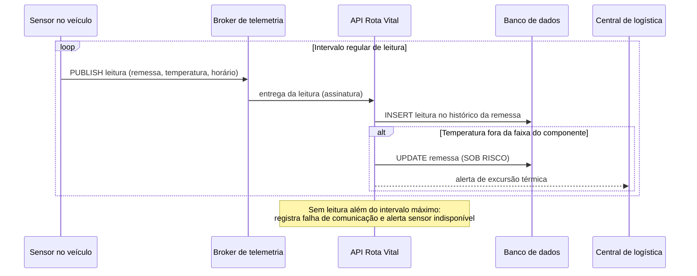

# Topologia de Rede — Rota Vital

Card **PI3E7-16 — W04-Topologia (RSD)**, dentro do épico **RSD - Arquitetura de comunicação e protocolos**.
Esta é a versão inicial da topologia; o refinamento fica para a W06.

A topologia parte do que já foi definido no projeto: o fluxo da Hemorrede descrito no `README.md`,
as histórias de usuário em `docs/rota-vital-historias-usuario.md` e a API já implementada em `backend/rotavital`.

---

## 1. Nós da rede

- **Hospitais** — registram solicitações e acompanham o status (História 4).
- **Hemocentros e unidades de armazenamento** — cadastram bolsas, consultam estoque e acionam a alocação FEFO (Histórias 1, 2 e 5).
- **Central de logística** — calcula rotas e acompanha as remessas em trânsito (Histórias 3 e 6).
- **Gestor** — consulta o painel de indicadores (História 7).
- **Veículos com sensor de temperatura** — enviam leituras durante o transporte (História 6, dados simulados).
- **Plataforma Rota Vital** — frontend web, API REST, banco de dados e broker de telemetria.

---

## 2. Topologia atual

Hoje a API Spring Boot e o banco H2 rodam no mesmo processo, na porta 8080. Os clientes (curl, Postman
ou o `medir.py` da atividade de threads) acessam a API direto por HTTP.

- Ligação ponto a ponto entre cada cliente e a API.
- Sem TLS e sem autenticação.
- Dados apagados a cada reinício (`ddl-auto=create-drop`).
- Console do H2 habilitado em `/h2-console`, com usuário `sa` e senha vazia.

---

## 3. Topologia proposta

### Modelo em estrela

Todas as unidades falam **somente com a plataforma central**, nunca diretamente entre si. O fluxo do
negócio já é centralizado: o hospital pede, a plataforma decide a alocação (ABO/Rh + FEFO) e a rota.
Com um único ponto de entrada também fica mais simples controlar acesso e registrar as operações.

O ponto fraco é a plataforma virar ponto único de falha. Réplicas e balanceamento entram no épico de
implantação da Unidade 2.

### Ligações e protocolos

| Ligação | Protocolo | Porta | Meio |
|---|---|---|---|
| Navegador → Proxy | HTTPS | 443 | Internet (cabo ou Wi-Fi da unidade) |
| Proxy → Frontend | HTTP | — | Rede interna |
| Proxy → API | HTTP + JSON (REST) | 8080 | Rede interna |
| Veículo → Broker | MQTT sobre TLS | 8883 | Rede móvel (4G/5G) |
| Broker → API | MQTT | 1883 | Rede interna |
| API → Banco | JDBC (PostgreSQL) | 5432 | Rede interna |

A API continua na porta 8080, como já está hoje. O PostgreSQL entra no lugar do H2 (o driver já está
no `pom.xml`). Para a telemetria foi escolhido **MQTT**: é leve, funciona por publicação/assinatura e
aguenta melhor a conexão instável da rede móvel do que abrir uma requisição HTTPS a cada leitura.
A decisão final depende do contrato de API (W02).

### Camadas TCP/IP

| Camada | Unidades (navegador) | Veículos | Plataforma |
|---|---|---|---|
| Aplicação | HTTP/REST + JSON | MQTT | HTTP, MQTT, JDBC |
| Transporte | TCP + TLS | TCP + TLS | TCP |
| Rede | IP (Internet) | IP (operadora) | IP (rede privada) |
| Enlace | Ethernet / Wi-Fi | 4G / 5G | Rede virtual da nuvem |

---

## 4. Fluxos por história

| História | Fluxo | Endpoint |
|---|---|---|
| 1. Cadastro de bolsa | Hemocentro → API → Banco | `POST /api/bolsas`, `GET /api/bolsas`, `GET/PUT/DELETE /api/bolsas/{id}` |
| 2. Alocação FEFO | Hemocentro → API → Banco | `POST /api/alocacoes/solicitacoes/{solicitacaoId}/alocar` |
| 3. Rota de distribuição | Logística → API | ainda não implementado |
| 4. Solicitação hospitalar | Hospital → API → Banco | `POST /api/solicitacoes`, `GET /api/solicitacoes`, `GET /api/solicitacoes/fila`, `GET/PUT/DELETE /api/solicitacoes/{id}` |
| 5. Alerta de vencimento | interno à API | ainda não implementado |
| 6. Cadeia fria | Veículo → Broker → API → Banco | ainda não implementado |
| 7. Painel de indicadores | Gestor → API → Banco | `GET /api/indicadores` |

### Solicitação e alocação (Histórias 4 e 2)

### Telemetria da cadeia fria (História 6)

---

## 5. Segurança

- Só o proxy e o broker ficam expostos; API e banco ficam na rede interna.
- TLS em tudo que sai da plataforma (navegadores e veículos).
- Banco acessível apenas pela API.
- Login por perfil (hospital, operador, logística, gestor), como pedem as Histórias 1 e 4.
- Credencial própria para cada sensor no broker.
- Console do H2 desligado fora do ambiente de desenvolvimento.
- Todos os dados são sintéticos.

---

## 6. Premissas

- Rede nacional simulada com 3.000 unidades de armazenamento e 5.000 hospitais (mesma massa usada no relatório de cobertura).
- Uma unidade atende hospitais a até 150 km.
- Leituras de temperatura simuladas, em intervalos regulares.

---

## 7. Próximos passos

- **W02 — Contratos de API (RSD):** formalizar os endpoints e fechar o protocolo da telemetria.
- **W04/W06 — Pipeline e CI/CD (SO):** definir onde a plataforma roda.
- **W06 — Topologia (RSD):** detalhar a topologia física com o ambiente real de deploy.
- **W06 — Grafo/FEFO (AED):** habilitar o fluxo de rotas (História 3).
- **W12 — Benchmarking/painel de rede (RSD):** medir latência e vazão das ligações.
