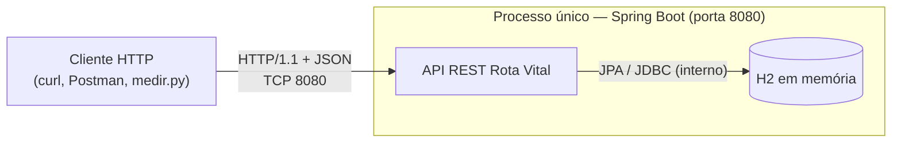
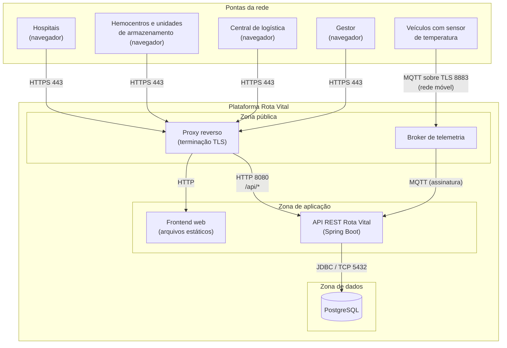
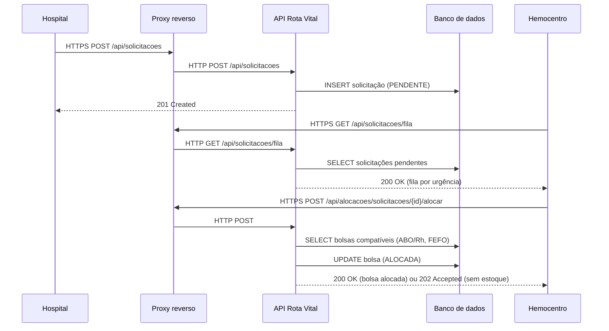
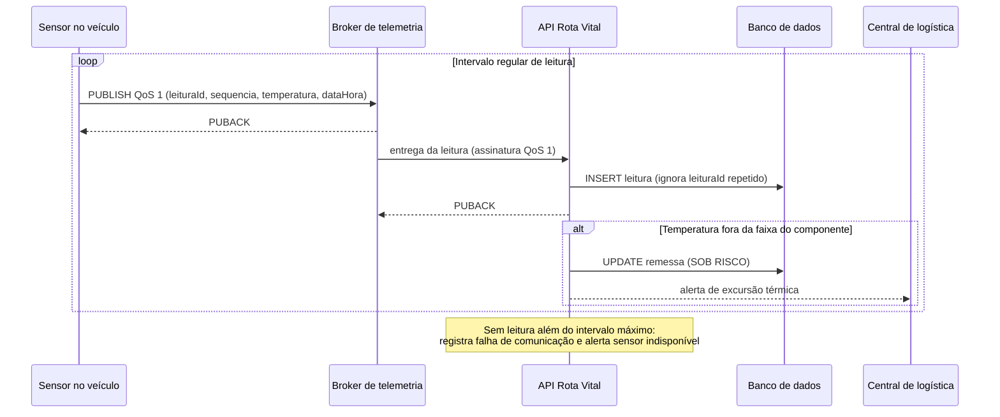

# Topologia de Rede — Rota Vital

Card **PI3E7-16 — W04-Topologia (RSD)**, dentro do épico **RSD - Arquitetura de comunicação e protocolos**.
Esta é a versão inicial da topologia; o refinamento fica para a W06.

A topologia parte do que já foi definido no projeto: o fluxo da Hemorrede descrito no `README.md`,
as histórias de usuário em `docs/rota-vital-historias-usuario.md` e a API já implementada em `backend/rotavital`.

---

## 1. Nós da rede

- **Hospitais** — registram solicitações e acompanham o status (História 4).
- **Hemocentros e unidades de armazenamento** — cadastram bolsas, consultam estoque e acionam a alocação FEFO (Histórias 1, 2 e 5).
- **Central de logística** — calcula rotas e acompanha as remessas em trânsito (Histórias 3 e 6).
- **Gestor** — consulta o painel de indicadores (História 7).
- **Veículos com sensor de temperatura** — enviam leituras durante o transporte (História 6, dados simulados).
- **Plataforma Rota Vital** — frontend web, API REST, banco de dados e broker de telemetria.

---

## 2. Topologia atual

Hoje a API Spring Boot e o banco H2 rodam no mesmo processo, na porta 8080. Os clientes (curl, Postman
ou o `medir.py` da atividade de threads) acessam a API direto por HTTP.

- Ligação ponto a ponto entre cada cliente e a API.
- Sem TLS e sem autenticação.
- Dados apagados a cada reinício (`ddl-auto=create-drop`).
- Console do H2 habilitado em `/h2-console`, com usuário `sa` e senha vazia.

---

## 3. Topologia proposta

### Modelo em estrela

Todas as unidades falam **somente com a plataforma central**, nunca diretamente entre si. O fluxo do
negócio já é centralizado: o hospital pede, a plataforma decide a alocação (ABO/Rh + FEFO) e a rota.
Com um único ponto de entrada também fica mais simples controlar acesso e registrar as operações.

O ponto fraco é a plataforma virar ponto único de falha. Réplicas e balanceamento entram no épico de
implantação da Unidade 2.

### Ligações e protocolos

| Ligação | Protocolo | Porta | Meio |
|---|---|---|---|
| Navegador → Proxy | HTTPS | 443 | Internet (cabo ou Wi-Fi da unidade) |
| Proxy → Frontend | HTTP | — | Rede interna |
| Proxy → API | HTTP + JSON (REST) | 8080 | Rede interna |
| Veículo → Broker | MQTT sobre TLS | 8883 | Rede móvel (4G/5G) |
| Broker → API | MQTT | 1883 | Rede interna |
| API → Banco | JDBC (PostgreSQL) | 5432 | Rede interna |

A API continua na porta 8080, como já está hoje. Para a telemetria foi escolhido **MQTT**: é leve,
funciona por publicação/assinatura e aguenta melhor a conexão instável da rede móvel do que abrir uma
requisição HTTPS a cada leitura.

### Evolução por entrega

A topologia proposta não entra de uma vez. O que muda em cada etapa:

| Etapa | Banco | Telemetria | O que muda na rede |
|---|---|---|---|
| Entrega 02 (atual) | H2 em memória | — | Nada: API e banco no mesmo processo, acesso direto na porta 8080 |
| Entrega U1 — primeiro deploy (W04/W06 SO) | PostgreSQL | — | Banco sai do processo da API e passa para a zona de dados (TCP 5432); entra o proxy com HTTPS |
| Unidade 2 — cadeia fria (História 6) | PostgreSQL | MQTT | Entram o broker e a ligação com os veículos (TCP 8883) |

O PostgreSQL entra junto com o primeiro deploy porque, no ambiente publicado, os dados precisam
sobreviver a um reinício, o que o H2 em memória não garante (`ddl-auto=create-drop`). O driver já está
no `pom.xml`. O H2 continua sendo usado nos testes e no desenvolvimento local. A data exata depende do
pipeline de SO (PI3E7-15 e PI3E7-21).

### MQTT: tópicos e QoS

As leituras de temperatura usam **QoS 1 (pelo menos uma vez)**:

- **QoS 0** não serve: se o sinal cair no meio do envio, a leitura se perde sem aviso, e a História 6 exige histórico completo da remessa.
- **QoS 2** garante entrega exatamente uma vez, mas exige quatro mensagens por leitura, o que pesa na rede móvel.
- **QoS 1** garante a entrega com confirmação (`PUBACK`). Se a confirmação não chegar, o sensor reenvia. A duplicata é descartada pela API, porque cada leitura tem um `leituraId` único.

| Tópico | Quem publica | QoS | Conteúdo |
|---|---|---|---|
| `rotavital/remessas/{remessaId}/temperatura` | Sensor do veículo | 1 | `leituraId`, `sensorId`, `sequencia`, `temperatura`, `dataHora` |
| `rotavital/sensores/{sensorId}/status` | Broker (mensagem de última vontade) | 1, retida | `offline` quando o sensor cai sem se desconectar |

Comportamento em conexão instável:

- **Sessão persistente** (`cleanSession=false`): o broker guarda o que foi publicado para a API enquanto ela estiver reconectando.
- **Buffer no sensor:** sem sinal, o sensor guarda as leituras e envia em ordem quando a conexão volta.
- **Keep-alive de 30 s + mensagem de última vontade:** o broker avisa quando um sensor some, o que alimenta o alerta de "sensor indisponível" da História 6.

### Camadas TCP/IP

| Camada | Unidades (navegador) | Veículos | Plataforma |
|---|---|---|---|
| Aplicação | HTTP/REST + JSON | MQTT | HTTP, MQTT, JDBC |
| Transporte | TCP + TLS | TCP + TLS | TCP |
| Rede | IP (Internet) | IP (operadora) | IP (rede privada) |
| Enlace | Ethernet / Wi-Fi | 4G / 5G | Rede virtual da nuvem |

---

## 4. Fluxos por história

| História | Fluxo | Endpoint |
|---|---|---|
| 1. Cadastro de bolsa | Hemocentro → API → Banco | `POST /api/bolsas`, `GET /api/bolsas`, `GET/PUT/DELETE /api/bolsas/{id}` |
| 2. Alocação FEFO | Hemocentro → API → Banco | `POST /api/alocacoes/solicitacoes/{solicitacaoId}/alocar` |
| 3. Rota de distribuição | Logística → API | ainda não implementado |
| 4. Solicitação hospitalar | Hospital → API → Banco | `POST /api/solicitacoes`, `GET /api/solicitacoes`, `GET /api/solicitacoes/fila`, `GET/PUT/DELETE /api/solicitacoes/{id}` |
| 5. Alerta de vencimento | interno à API | ainda não implementado |
| 6. Cadeia fria | Veículo → Broker → API → Banco | ainda não implementado |
| 7. Painel de indicadores | Gestor → API → Banco | `GET /api/indicadores` |

### Solicitação e alocação (Histórias 4 e 2)

### Telemetria da cadeia fria (História 6)

---

## 5. Segurança

- Só o proxy e o broker ficam expostos; API e banco ficam na rede interna.
- TLS em tudo que sai da plataforma (navegadores e veículos).
- Banco acessível apenas pela API.
- Login por perfil (hospital, operador, logística, gestor), como pedem as Histórias 1 e 4.
- Credencial própria para cada sensor no broker.
- Console do H2 desligado fora do ambiente de desenvolvimento.
- Todos os dados são sintéticos.

---

## 6. Observabilidade

### Logs

- Logs em JSON, com o mesmo `leituraId` em todas as etapas (broker → API → banco). Assim dá para buscar uma leitura e ver por onde ela passou.
- Requisições REST recebem um `X-Request-Id` no proxy, repassado para a API e gravado em todos os logs daquela requisição.
- Eventos registrados por leitura: `leitura_recebida`, `leitura_duplicada`, `leitura_rejeitada` (com o motivo), `leitura_gravada`, `excursao_termica`.

### Métricas

| Métrica | Para que serve |
|---|---|
| Leituras recebidas por minuto (por remessa) | Ver se os sensores estão enviando no ritmo esperado |
| Leituras rejeitadas e duplicadas | Detectar sensor com defeito ou reenvio excessivo por sinal ruim |
| Atraso entre `dataHora` da leitura e a gravação | Medir a latência da rede móvel até a plataforma |
| Sensores sem leitura além do intervalo máximo | Alimentar o alerta de sensor indisponível |
| Tempo de resposta e erros por endpoint REST | Acompanhar a saúde da API |

A API expõe as métricas e o health check pelo Spring Boot Actuator (`/actuator/health` e `/actuator/prometheus`),
acessíveis só pela rede interna. Esses dados alimentam o painel de rede da W12.

### Rastreando uma leitura que falhou

1. **A leitura nunca chegou:** a API compara a `sequencia` recebida com a anterior do mesmo sensor. Um salto (por exemplo, 41 → 44) registra as leituras 42 e 43 como perdidas no log da remessa.
2. **Chegou, mas foi rejeitada** (temperatura fora do intervalo físico, remessa inexistente, JSON inválido): a leitura vai para a tabela `leitura_rejeitada` com o motivo e o `leituraId`, sem travar as próximas.
3. **O sensor caiu:** o broker publica `offline` em `rotavital/sensores/{sensorId}/status`. A API registra a falha de comunicação e dispara o alerta da História 6.

---

## 7. Premissas

- Rede nacional simulada com 3.000 unidades de armazenamento e 5.000 hospitais (mesma massa usada no relatório de cobertura).
- Uma unidade atende hospitais a até 150 km.
- Leituras de temperatura simuladas, em intervalos regulares.

---

## 8. Próximos passos

Antes de a topologia sair do papel, o contrato de API (W02 — PI3E7-14) precisa cobrir:

| Endpoint / tópico | Situação | Necessário para |
|---|---|---|
| `POST/GET /api/bolsas`, `GET/PUT/DELETE /api/bolsas/{id}` | Implementado | Histórias 1 e 5 |
| `POST/GET /api/solicitacoes`, `GET /api/solicitacoes/fila`, `GET/PUT/DELETE /api/solicitacoes/{id}` | Implementado | História 4 |
| `POST /api/alocacoes/solicitacoes/{solicitacaoId}/alocar` | Implementado | História 2 |
| `GET /api/indicadores` | Implementado | História 7 |
| `GET /actuator/health` | A criar | Proxy e deploy saberem se a API está no ar |
| `GET /api/remessas/{id}` e `GET /api/remessas/{id}/leituras` | A criar | História 6 (status e histórico da remessa) |
| Tópico `rotavital/remessas/{remessaId}/temperatura` (formato da leitura) | A criar | História 6 |
| `POST /api/rotas` | A criar | História 3 (depende do grafo da AED) |

Os endpoints já implementados só precisam ser documentados. Os novos entram no contrato antes do
código, para que telemetria, rotas e frontend sigam o mesmo formato.
